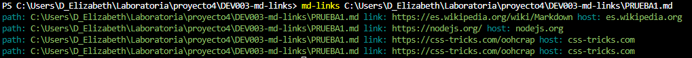
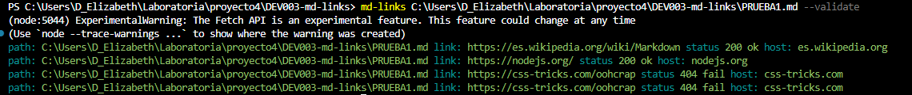
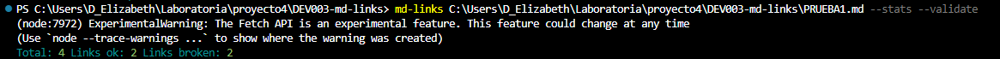

# Markdown Links

## Índice

* [1. Preámbulo](#1-preámbulo)
* [2. Resumen del proyecto](#2-resumen-del-proyecto)
* [3. Implementación y uso ](#2-implementacion-y-uso)
* [4. Objetivos de aprendizaje](#3-objetivos-de-aprendizaje)
* [5. Checklist](#9-checklist)

***

## 1. Preámbulo

[Markdown](https://es.wikipedia.org/wiki/Markdown) es un lenguaje de marcado
ligero muy popular entre developers. Es usado en muchísimas plataformas que
manejan texto plano y es muy común encontrar varios archivos en ese formato en cualquier tipo de repositorio
(empezando por el tradicional `README.md`).

Estos archivos `Markdown` normalmente contienen _links_ (vínculos/ligas) que
muchas veces están rotos o ya no son válidos y eso perjudica mucho el valor de
la información que se quiere compartir.

## 2. Resumen del proyecto
En este proyecto se creó una librería usando [Node.js](https://nodejs.org/). Esta librería lee y analiza archivos
en formato `Markdown` (.md) y verificar los links que contengan. También cuenta la cantidad de links totales, únicos, rotos y los que funcionan correctamente.

En este proyecto se desarrolló una línea de comando (CLI) así como una librería (library) en JavaScript, se utilizó la API 'fetch' para realizar peticiones HTTP asincrónas.

## 3. Implementación y uso

#### `mdLinks(path, options)`

##### Argumentos
###### `mdLinks(path)`
Puedes utilizar esta librería para ver los links que contiene tu marckdown. Debes poner el comando `mdLinks(path)`
* `path`: Ruta **absoluta** o **relativa** al **archivo** o **directorio**.
Si la ruta pasada es relativa, debes estar posicionado en el sitio dónde se encuentra dicho archivo, de lo contrario debes colcar el path absoluto.

* `path`: Ruta del archivo donde se encontró el link. `link`: URL encontrada. `host`: Texto que aparecía dentro del link (`<a>`). 

###### `option --validate`
Si pasamos la opción `--validate`, se hace una petición HTTP para averiguar si el link funciona o no. Por ejemplo:
* `status`: Código de respuesta HTTP (200, 400, etc.). 
* `ok`: Mensaje `fail` en caso de fallo u `ok` en caso de éxito. 
Ejemplo:

* `path`: Ruta del archivo donde se encontró el link. `link`: URL encontrada. `status`: Código de respuesta HTTP. `host`: Texto que aparecía dentro del link (`<a>`).

###### `option --stats`
Si pasamos la opción `--stats` el output (salida) será un texto con estadísticas básicas sobre los links. Por ejemplo:

* `Total`: 3 `Links uniques`: 3.
###### `option --stats --validate`
También podemos combinar `--stats` y `--validate` para obtener estadísticas que
necesiten de los resultados de la validación. Ejemplo: 

* `Total`: 3; `Links ok`: 3; `Links broken`: 1.

## 4. Objetivos de aprendizaje

A continuación se marcan los objetivos que se lograron entender y aplicar:

### JavaScript

- [x] **Diferenciar entre tipos de datos primitivos y no primitivos**

- [x] **Arrays (arreglos)**

  

Links

  * [Arreglos](https://curriculum.laboratoria.la/es/topics/javascript/04-arrays)
  * [Array - MDN](https://developer.mozilla.org/es/docs/Web/JavaScript/Reference/Global_Objects/Array/)
  * [Array.prototype.sort() - MDN](https://developer.mozilla.org/es/docs/Web/JavaScript/Reference/Global_Objects/Array/sort)
  * [Array.prototype.forEach() - MDN](https://developer.mozilla.org/es/docs/Web/JavaScript/Reference/Global_Objects/Array/forEach)
  * [Array.prototype.map() - MDN](https://developer.mozilla.org/es/docs/Web/JavaScript/Reference/Global_Objects/Array/map)
  * [Array.prototype.filter() - MDN](https://developer.mozilla.org/es/docs/Web/JavaScript/Reference/Global_Objects/Array/filter)
  * [Array.prototype.reduce() - MDN](https://developer.mozilla.org/es/docs/Web/JavaScript/Reference/Global_Objects/Array/Reduce)

- [x] **Objetos (key, value)**

  

Links

  * [Objetos en JavaScript](https://curriculum.laboratoria.la/es/topics/javascript/05-objects/01-objects)

- [x] **Uso de condicionales (if-else, switch, operador ternario, lógica booleana)**

  

Links

  * [Estructuras condicionales y repetitivas](https://curriculum.laboratoria.la/es/topics/javascript/02-flow-control/01-conditionals-and-loops)
  * [Tomando decisiones en tu código — condicionales - MDN](https://developer.mozilla.org/es/docs/Learn/JavaScript/Building_blocks/conditionals)

- [x] **Funciones (params, args, return)**

  

Links

  * [Funciones (control de flujo)](https://curriculum.laboratoria.la/es/topics/javascript/02-flow-control/03-functions)
  * [Funciones clásicas](https://curriculum.laboratoria.la/es/topics/javascript/03-functions/01-classic)
  * [Arrow Functions](https://curriculum.laboratoria.la/es/topics/javascript/03-functions/02-arrow)
  * [Funciones — bloques de código reutilizables - MDN](https://developer.mozilla.org/es/docs/Learn/JavaScript/Building_blocks/Functions)

- [ ] **Recursión o recursividad**

  

Links

  * [Píldora recursión - YouTube Laboratoria Developers](https://www.youtube.com/watch?v=lPPgY3HLlhQ)
  * [Recursión o Recursividad - Laboratoria Developers en Medium](https://medium.com/laboratoria-developers/recursi%C3%B3n-o-recursividad-ec8f1a359727)

- [x] **Módulos de CommonJS**

  

Links

  * [Modules: CommonJS modules - Node.js Docs](https://nodejs.org/docs/latest/api/modules.html)

- [x] **Diferenciar entre expresiones (expressions) y sentencias (statements)**

- [x] **Callbacks**

  

Links

  * [Función Callback - MDN](https://developer.mozilla.org/es/docs/Glossary/Callback_function)

- [x] **Promesas**

  

Links

  * [Promise - MDN](https://developer.mozilla.org/es/docs/Web/JavaScript/Reference/Global_Objects/Promise)
  * [How to Write a JavaScript Promise - freecodecamp (en inglés)](https://www.freecodecamp.org/news/how-to-write-a-javascript-promise-4ed8d44292b8/)

- [x] **Pruebas unitarias (unit tests)**

  

Links

  * [Empezando con Jest - Documentación oficial](https://jestjs.io/docs/es-ES/getting-started)

- [x] **Pruebas asíncronas**

  

Links

  * [Tests de código asincrónico con Jest - Documentación oficial](https://jestjs.io/docs/es-ES/asynchronous)

- [x] **Uso de mocks y espías**

  

Links

  * [Manual Mocks con Jest - Documentación oficial](https://jestjs.io/docs/es-ES/manual-mocks)

- [ ] **Pruebas de compatibilidad en múltiples entornos de ejecución**

- [x] **Uso de linter (ESLINT)**

- [x] **Uso de identificadores descriptivos (Nomenclatura y Semántica)**

### Node.js

- [x] **Instalar y usar módulos con npm**

  

Links

  * [Sitio oficial de npm (en inglés)](https://www.npmjs.com/)

- [x] **Configuración de package.json**

  

Links

  * [package.json - Documentación oficial (en inglés)](https://docs.npmjs.com/files/package.json)

- [x] **Configuración de npm-scripts**

  

Links

  * [scripts - Documentación oficial (en inglés)](https://docs.npmjs.com/misc/scripts)

- [x] **process (env, argv, stdin-stdout-stderr, exit-code)**

  

Links

  * [Process - Documentación oficial (en inglés)](https://nodejs.org/api/process.html)

- [x] **File system (fs, path)**

  

Links

  * [File system - Documentación oficial (en inglés)](https://nodejs.org/api/fs.html)
  * [Path - Documentación oficial (en inglés)](https://nodejs.org/api/path.html)

### Control de Versiones (Git y GitHub)

- [x] **Git: Instalación y configuración**

- [x] **Git: Control de versiones con git (init, clone, add, commit, status, push, pull, remote)**

- [x] **Git: Integración de cambios entre ramas (branch, checkout, fetch, merge, reset, rebase, tag)**

- [x] **GitHub: Creación de cuenta y repos, configuración de llaves SSH**

- [x] **GitHub: Colaboración en Github (branches | forks | pull requests | code review | tags)**

- [x] **GitHub: Organización en Github (projects | issues | labels | milestones | releases)**

### HTTP

- [x] **Consulta o petición (request) y respuesta (response).**

  

Links

  * [Generalidades del protocolo HTTP - MDN](https://developer.mozilla.org/es/docs/Web/HTTP/Overview)
  * [Mensajes HTTP - MDN](https://developer.mozilla.org/es/docs/Web/HTTP/Messages)

- [x] **Códigos de status de HTTP**

  

Links

  * [Códigos de estado de respuesta HTTP - MDN](https://developer.mozilla.org/es/docs/Web/HTTP/Status)
  * [The Complete Guide to Status Codes for Meaningful ReST APIs - dev.to](https://dev.to/khaosdoctor/the-complete-guide-to-status-codes-for-meaningful-rest-apis-1-5c5)

## 5. Checklist

### General

* [x] Puede instalarse via `npm install --global <github-user>/md-links`

### `README.md`

* [x] Un board con el backlog para la implementación de la librería.
* [x] Documentación técnica de la librería.
* [x] Guía de uso e instalación de la librería

### API `mdLinks(path, opts)`

* [x] El módulo exporta una función con la interfaz (API) esperada.
* [x] Implementa soporte para archivo individual
* [ ] Implementa soporte para directorios
* [x] Implementa `options.validate`

### CLI

* [x] Expone ejecutable `md-links` en el path (configurado en `package.json`)
* [x] Se ejecuta sin errores / output esperado
* [x] Implementa `--validate`
* [x] Implementa `--stats`

### Pruebas / tests
* [ ] Pruebas unitarias cubren un mínimo del 70% de statements, functions, lines, y branches.
* [x] Pasa tests (y linters) (npm test).
